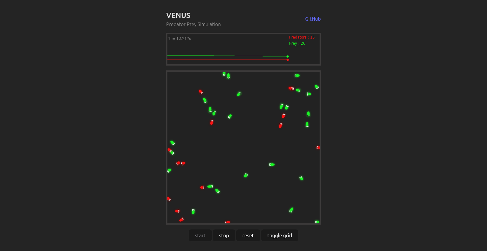

# venus
A simulation of a predator-prey world

## overview
With inspiration from [_Evolving AIs: Predator vs Prey_](https://www.youtube.com/watch?v=qwrp3lB-jkQ), 
this project tries to reverse engineer the system as shown in this [video](https://www.youtube.com/watch?v=qwrp3lB-jkQ). 

While the implementation depends on `Math.random()`, machine learning (ai) algorithms and libraries 
(such as [brain.js](https://brain.js.org/), [tensorflowjs](https://www.tensorflow.org/js), [ml5.js](https://ml5js.org/)) are to be put to use to power the behaviourof the agents. 
This follows addition of more characteristics that make it more like a real world scenario.

## live demo
Try it yourself: [Demo](https://henryhale.github.io/venus/)

## screenshot

## license

Released under [MIT License](./LICENSE.txt)

Copyright &copy; 2023 [Henry Hale](https://github.com/henryhale)
